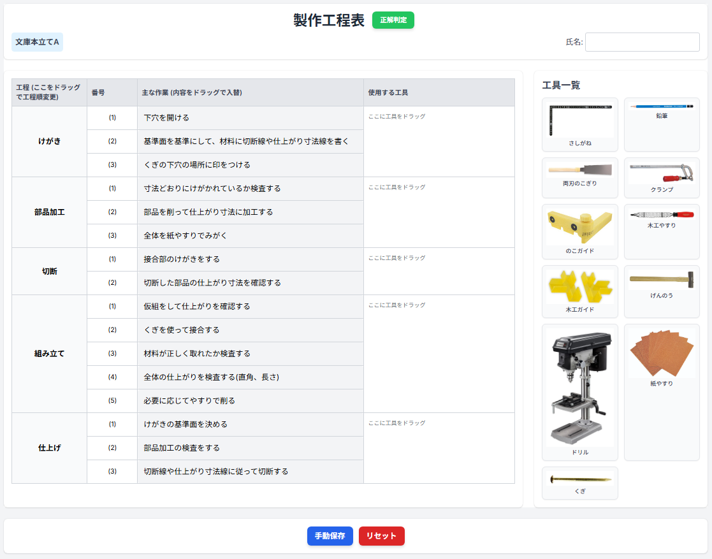

# 製作工程表パズル 🧩

中学校技術科の授業で活用できる、製作工程表を**パズルのように組み立てるWebアプリ**です。  
HTML＋JavaScriptで構成されており、ブラウザで簡単に動作します。

 <!-- 任意でスクショがあればここに置けます -->

---

## 🔗 公開ページ

📌 GitHub Pages で公開中：  
👉 [https://keigox68000.github.io/kouteipuzzle/](https://keigox68000.github.io/kouteipuzzle/)

---

## 🧑‍🏫 このアプリでできること

- 工程表をドラッグ＆ドロップで作成
- 作業順・作業名・工具などを視覚的に配置
- 生徒が思考しながら工程を構成できる
- **Chromebookやタブレットでも使用可**

---

## 🛠️ 技術構成

- HTML / CSS / JavaScript（**フレームワーク未使用**）
- Tailwind CSS（CDN）
- html2canvas（PNG画像出力用ライブラリ）
- オンライン環境で動作（CDN依存）
- GitHub Pages にて公開
※ Tailwind CSS および html2canvas はCDN経由で読み込まれており、ネット接続が必要です。

---
```
## 📁 ファイル構成

kouteipuzzle/
├── kouteipuzzle.html       # メインアプリ（工程パズル）
├── images/                 # アプリ内で使用する画像（工具など）
│   ├── sashigane.jpg
│   ├── enpitsu.jpg
│   └── ... 他の画像 ...
├── index.html              # トップページ（GitHub Pages 用）
├── README.md               # この説明ファイル
└── docs/                   # 説明用のスクリーンショットなど
    └── kouteipuzzle.png

※ `index.html` は GitHub Pages のトップページとして使用されます（アプリ本体ではありません）。
```
